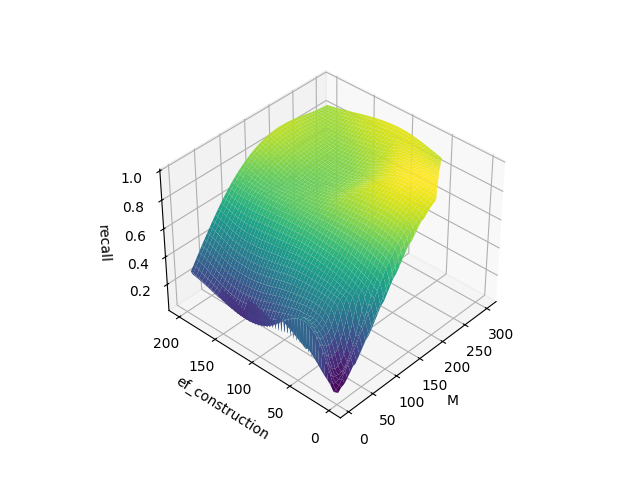
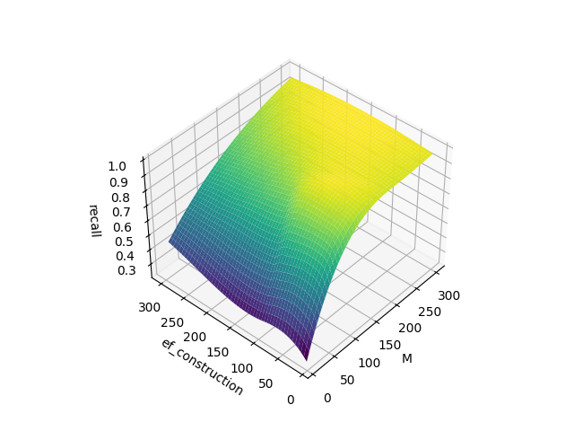

# HNSWLib recall measurement scripts

This repo contains some scripts to measure and visualize the recall for [hnswlib](https://github.com/nmslib/hnswlib/tree/master) based vector indices.

Additional information and the original measurement script can be found in the [hnswlib repo](https://github.com/nmslib/hnswlib/blob/master/TESTING_RECALL.md).

Don't test with less than 100k vectors. Otherwiese your results can be incorrect.

```bash
python3.11 -m venv venv
. venv/bin/activate
pip install -r requirements.txt

# Args: M, ef_construction
python test-recall.py 100 100

# Display surface graph (values are hardcoded)
python show-recall.py
```

# HNSW - l2, dim 1024 

* M: 250-300
* ef_construction: 100





# HNSW - l2, dim 256

* M: 280
* ef_construction: 50
* recall: ~0.91



